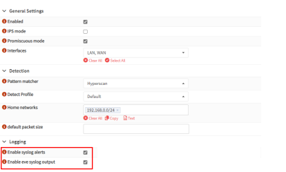
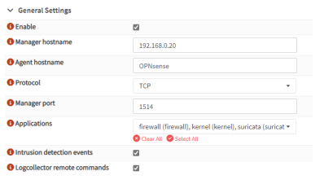
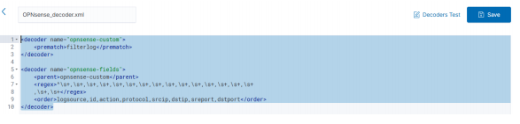
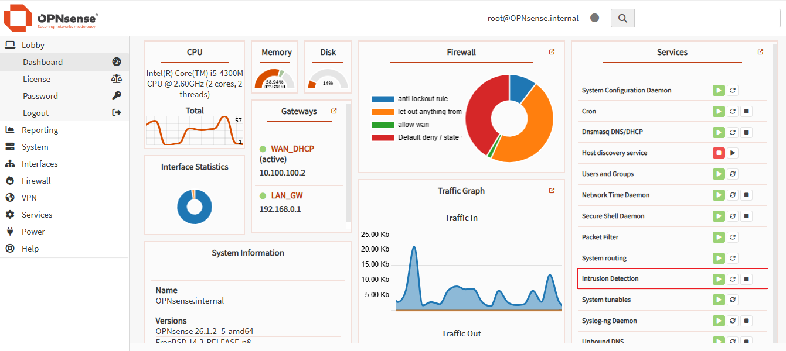
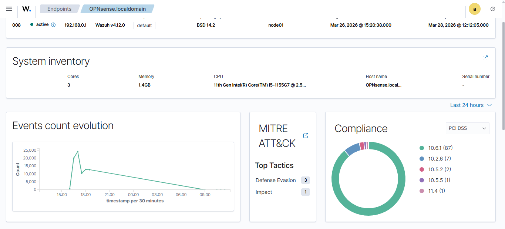
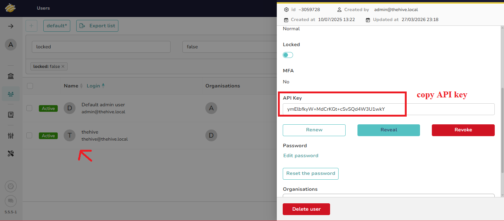
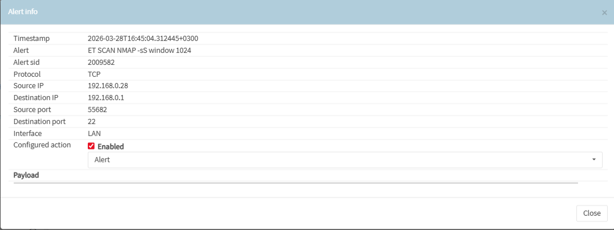
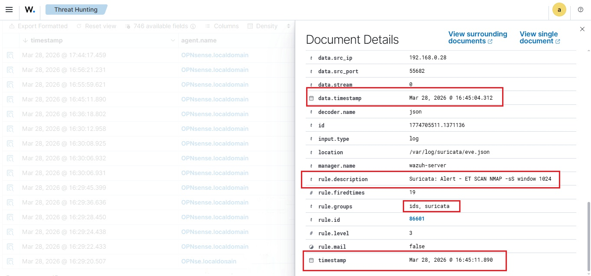
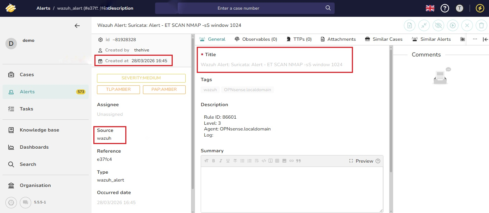

# Wazuh-TheHive Integration: A Practical SOC Implementation

## Abstract

This document details the successful integration of Wazuh, TheHive, and OPNsense to establish a robust Security Operations Center (SOC) data pipeline. The objective was to transform raw network traffic into actionable security cases within TheHive, leveraging Wazuh for centralized log correlation and OPNsense (with Suricata) as the primary network sensor. The integration process, including configuration steps, troubleshooting, and validation through a simulated Nmap stealth scan, is thoroughly documented. This setup demonstrates an automated workflow from threat detection to incident response, enhancing overall security posture.

### 1. Introduction

In modern cybersecurity, effective threat detection and incident response are paramount. This project focuses on building a practical, open-source SOC solution by integrating three powerful platforms: OPNsense, Wazuh, and TheHive. The goal is to create a seamless data flow where network events detected by OPNsense are forwarded to Wazuh for analysis and correlation, subsequently escalating critical alerts to TheHive for incident management and remediation.

This integration aims to:

- **Centralize Log Management:** Aggregate security logs from various sources into Wazuh.

- **Automate Threat Detection:** Utilize Wazuh's capabilities for real-time threat detection and alert generation.

- **Streamline Incident Response:** Automatically create and manage security incidents in TheHive based on Wazuh alerts.

- **Enhance Visibility:** Provide a comprehensive overview of the security landscape.

### 2. Architecture Overview

The proposed architecture involves a three-tiered approach:

1. **Network Sensor (OPNsense with Suricata):** OPNsense, acting as a firewall and intrusion detection system (IDS) with Suricata, monitors network traffic and generates security events.

2. **Security Information and Event Management (SIEM) - Wazuh:** Wazuh collects, analyzes, and correlates logs from OPNsense and other endpoints. It is responsible for detecting anomalies and generating alerts based on predefined rules.

3. **Security Incident Response Platform (SIRP) - TheHive:** TheHive receives alerts from Wazuh, transforming them into actionable cases for security analysts to investigate and manage.
### 3. Integration Stages

**3.1. Stage 1:** **Log Forwarding (OPNsense → Wazuh)**

This stage focuses on configuring OPNsense to forward relevant security logs to the Wazuh Manager for centralized analysis.

**3.1.1. Configure Suricata IDS on OPNsense**

To ensure a continuous stream of threat telemetry, Suricata IDS on OPNsense must be configured to enable Syslog alerts and EVE logging. This setup ensures that critical network intrusion events are captured and made available for forwarding.




**3.1.2. Configure Wazuh Manager for Suricata EVE.JSON Ingestion**

The Wazuh Manager's ossec.conf file needs to be updated to ingest JSON logs from the Suricata eve.json file location. This configuration enables precise parsing and correlation of network alerts generated by Suricata.

```
<localfile>
    <log_format>json</log_format>
    <location>/var/log/suricata/eve.json</location>
</localfile>
```

**3.1.3. Configure Wazuh Agent on OPNsense**

A Wazuh Agent must be installed and configured on OPNsense to establish a secure connection with the Wazuh Manager via TCP on port 1514. This ensures the reliable transmission of system logs and Intrusion Detection System (IDS) events from OPNsense to Wazuh.



**3.1.4. Add Custom Decoder for OPNsense on Wazuh Server**

To effectively parse OPNsense firewall logs, a custom decoder is required on the Wazuh Manager. This decoder utilizes Regular Expressions (Regex) to extract critical fields such as source IP (srcip), destination IP (dstip), and protocol from raw firewall logs, facilitating accurate analysis.



**3.1.5. Implement Custom Rules for OPNsense on Wazuh Server**

Custom Wazuh rules are essential for classifying OPNsense traffic and detecting specific security events. For instance, Rule 100903 is designed to identify scanning or brute-force attempts by triggering a Level 10 alert when 18 block events originate from the same source IP within a 45-second window. 

**3.2. Troubleshooting: Suricata Alerts Missing**

During the integration, a specific issue was encountered where OPNsense successfully connected to Wazuh, and firewall logs were flowing normally, but Suricata (IDS) alerts were missing from the Wazuh dashboard. This partial data loss was not covered in the official documentation.

Root Cause: The problem stemmed from an authentication failure in the Filebeat service, which is responsible for forwarding Suricata's eve.json logs. The Filebeat configuration was not correctly authenticating with the Wazuh Dashboard.

**Resolution Steps:**

1. **Access Filebeat Configuration:** Edit the Filebeat configuration file:
```bash
sudo nano /etc/filebeat/filebeat.yml
```
3. **Update Output Section:** Manually
update the output section with the correct Wazuh Dashboard username and password (e.g., admin).

4. **Verify and Restart:** Restart the Filebeat service and verify its output:

```bash
sudo systemctl restart filebeat
sudo filebeat test output
```
After implementing these steps, Suricata alerts began flowing correctly alongside the firewall logs, resolving the data loss issue.





**3.3. Stage 2: Integratet Wazuh and TheHive**

This stage outlines the process of integrating Wazuh with TheHive to enable automated incident creation and management.

**3.3.1. TheHive User and API Key Generation**

The integration begins by creating a new user in TheHive with an Analyst role. Subsequently, an API Key is generated for this user. This API key serves as the secure credential for Wazuh to programmatically forward alerts and create cases within TheHive.



**3.3.2. Install thehive4py Library on Wazuh Manager**

The thehive4py library (version 1.8.1) is essential for the integration script to communicate with TheHive API. It must be installed using the Wazuh-specific pip3 package manager:

```bash
sudo /var/ossec/framework/python/bin/pip3 install thehive4py==1.8.1
```

**3.3.3. Python Integration Script**

A Python script acts as a translator, converting raw Wazuh alerts into a format compatible with TheHive. It extracts critical alert details, such as rule descriptions, severity levels, and agent names, and forwards them via POST requests to TheHive's API. This automation facilitates the seamless creation of incident alerts, complete with metadata and tags for improved forensic analysis.

**3.3.4. Bash Wrapper Script**

A Bash script serves as an execution wrapper, ensuring the Python integration script runs correctly within the secure Wazuh environment. Its primary function is to define the necessary paths for Wazuh's internal Python binary and libraries, guaranteeing a stable and isolated integration process independent of the host system's global configurations.

**3.3.5. Set Permissions for Integration Scripts**

To ensure proper execution, the necessary permissions must be granted to both the Python and Bash integration files:

```bash
chmod 750 /var/ossec/integrations/custom-w2thive*
chown root:wazuh /var/ossec/integrations/custom-w2thive*
```

**3.3.6. Configure Wazuh ossec.conf for TheHive Integration**

The Wazuh Manager's main configuration file (ossec.conf) is modified to include the TheHive integration block. By inserting TheHive's hook_url and the previously generated API Key, Wazuh is enabled to programmatically forward alerts in JSON format, automatically creating incident cases upon detection.

```conf
<integration>
    <name>custom-w2thive</name><hook_url>http://192.168.0.100:9000</hook_url><api_key>ymElbfkyW+MdCrKGt+cSvSQd4W3U1wkY</api_key>
    <alert_format>json</alert_format>
</integration>
```


After saving the file, the Wazuh Manager service must be restarted for the changes to take effect:

```bash
sudo systemctl restart wazuh-manager
```

### 4. System Testing & Verification

To validate the end-to-end integration, a SYN Stealth Scan (nmap -sS ) is performed against the OPNsense WAN IP. The objective is to verify that Suricata detects the scanning attempt, prompting Wazuh to parse the log and trigger an immediate alert to TheHive for incident case creation.

```bash
nmap -sS <OPNsense_WAN_IP>
```







### 4.1. Validation Results

The results demonstrate a successful end-to-end integration between OPNsense, Wazuh, and TheHive. Following the Nmap scan simulation, the alert lifecycle was validated as follows:

- Detection (OPNsense): Suricata successfully detected the "Nmap -sS" scan from source 192.168.0.28 and logged the event in real-time.
- Analysis (Wazuh): The Wazuh Manager ingested the log, processed it through custom decoders, and triggered a security alert (Rule ID: 86601) visible on the dashboard.
- Incident Creation (TheHive): The integration script successfully forwarded the alert to TheHive. A new incident case was automatically created, containing all relevant metadata (Source: Wazuh, Severity: Medium, Tags: OPNsense), confirming the automation is fully operational.

### 5. Conclusion

This project successfully established a functional and automated SOC data pipeline by integrating OPNsense, Wazuh, and TheHive. The documented process, from log forwarding and custom rule creation to troubleshooting and system verification, provides a comprehensive guide for deploying a similar open-source security solution. This integration significantly enhances threat detection capabilities and streamlines incident response workflows, contributing to a more robust cybersecurity posture.

## References

[1] OPNsense Documentation:
[2] Wazuh Documentation:
[3] Suricata Documentation:
